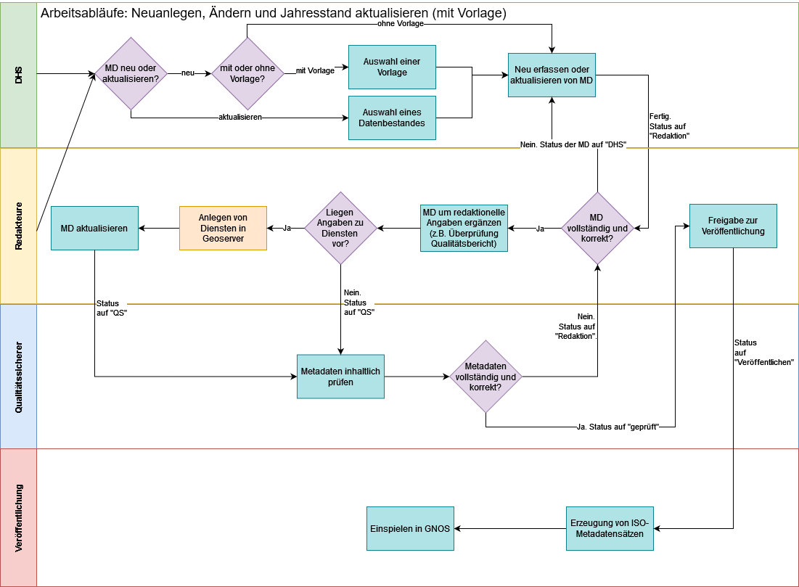
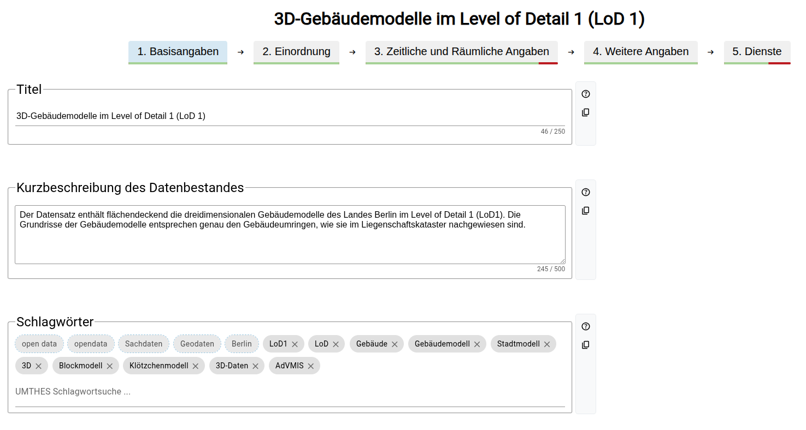
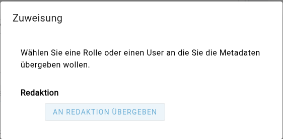

# Arbeitsabläufe

Die folgende Skizze zeigt die Arbeitsabläufe, die im MDE implementiert sind. Je nach Rolle, Berechtigungen und Status eines Metadatensatzes sind unterschiedliche Arbeitsabläufe möglich. Es ist zu beachten, dass die Arbeitsabläufe nicht strikt linear sind, sondern je nach Situation und Berechtigungen variieren können. In den meisten Fällen findet dabei eine iterative Interaktion zwischen den Rollen statt, um die Qualität der Metadatensätze zu gewährleisten.

Im Folgenden werden die wichtigsten Arbeitsabläufe detailliert beschrieben.

### Neuen Metadatensatz anlegen und Metadaten einpflegen

Sowohl Nutzende der Rolle DHS als auch Redaktion können einen neuen Metadatensatz anlegen. Dazu nutzen sie die [hier](./oberflaeche.mdx#neuerfassung-eines-metadatensatzes) beschriebene Funktion der Neuerfassung.

Anschließend werden im [Metadaten-Formular](./oberflaeche.mdx#metadaten-formular) die Metadaten eingegeben.

Wurde der Datensatz von der Rolle DHS angelegt, muss er im nächsten Schritt einer nutzenden Person der Rolle Redaktion zur Bearbeitung zugewiesen werden. Details dazu finden Sie weiter unten im Abschnitt [Zuweisen](#zuweisen). Diese ergänzt ggf. notwendige Informationen und übergibt den Datensatz anschließend an die Qualitätssicherung. Dort wird der Datensatz geprüft und ggf. zurück an die Redaktion gegeben, um weitere Ergänzungen vorzunehmen.

Sobald der Datensatz von der Qualitätssicherung als geprüft markiert wurde, geht er zurück an eine nutzende Person der Rolle Redaktion und kann veröffentlicht werden.

Sobald der Datensatz veröffentlicht ist, wird er im GeoNetwork opensource als Datensatz im Metadatenkatalog veröffentlicht.

### Bestehenden Metadatensatz pflegen

Um einen bestehenden Metadatensatz zu pflegen, muss dieser zunächst in der [Übersicht der Metadatensätze](./oberflaeche.mdx#übersicht-der-metadatensätze) geöffnet werden. Der Metadatensatz muss sich dabei im [Status](./oberflaeche.mdx#statusfilter) „zu bearbeiten“ befinden, d.h. er muss einer nutzenden Person zur Bearbeitung zugewiesen sein. Details zum Thema Zuweisung finden sich [hier](#zuweisen).

Die Pflege und Bearbeitung der Metadaten selbst erfolgt dann über das [Metadaten-Formular](./oberflaeche.mdx#metadaten-formular).

Wurde der Datensatz von der Rolle DHS bearbeitet, muss er im nächsten Schritt erst wieder einer nutzenden Person der Rolle Redaktion zur Bearbeitung zugewiesen werden. Details dazu finden Sie weiter unten im Abschnitt [Zuweisen](#zuweisen). Diese ergänzt ggf. notwendige Informationen und übergibt den Datensatz anschließend an die Qualitätssicherung. Dort wird der Datensatz geprüft und ggf. zurück an die Redaktion gegeben, um weitere Ergänzungen vorzunehmen.

Sobald der Datensatz von der Qualitätssicherung als geprüft markiert wurde, geht er zurück an eine nutzende Person der Rolle Redaktion und kann veröffentlicht werden.

Sobald der Datensatz veröffentlicht ist, wird er im GeoNetwork opensource als Datensatz im Metadatenkatalog veröffentlicht.

### Zuweisen

Da ein Metadatensatz dem Arbeitsablauf folgt und innerhalb des Arbeitsablaufs von verschiedenen Nutzenden bearbeitet werden kann, ist es notwendig, dass ein Metadatensatz einer nutzenden Person oder einer Rolle zugewiesen wird. Dadurch wird sichergestellt, dass der Datensatz nicht von mehreren Nutzenden gleichzeitig bearbeitet wird, was zu Konflikten führen könnte. Zudem ermöglicht die Zuweisung die Nachverfolgung der Bearbeitungshistorie eines Datensatzes.

In der Fußzeile des Editier-Formulars wird die Funktion „Zuweisen" angeboten, um einen Metadatensatz einer Rolle oder einer bestimmten nutzenden Person zuzuweisen. Je nach Rolle der nutzenden Person und Status des Metadatensatzes stehen unterschiedliche Optionen zur Zuweisung zur Verfügung. Bei Betätigung der Schaltfläche „Zuweisen" öffnet sich ein Dialog, in dem die verfügbaren Optionen angezeigt werden. Dieser sieht für einen von einer DHS erstellten Datensatz wie folgt aus:

Über die entsprechende Schaltfläche kann ein Metadatensatz einer Rolle oder auch einer bestimmten nutzenden Person der jeweiligen Rolle zugewiesen werden. Die Optionen der Zuweisung sind je nach Rolle unterschiedlich.

- DHS – kann einen Metadatensatz allgemein an die Rolle Redakteur übergeben
- Redakteur
  - kann die Zuordnung entfernen
  - kann nur an eine bestimmte nutzende Person der Rolle DHS den Metadatensatz übergeben.
  - kann den Metadatensatz an eine bestimmte nutzende Person der Rolle QS übergeben, falls es bereits Teammitglieder der Rolle QS gibt
  - kann an die Rolle QS übergeben
- QS
  - kann den Metadatensatz an die Rolle Redakteur übergeben
  - kann den Metadatensatz an ein Teammitglied der Rolle Redakteur übergeben
  - kann den Status Geprüft setzen
- Administrator – dem Administrator stehen alle Möglichkeiten inklusive der Markierung als geprüft zur Verfügung
