# Die Oberfläche und ihre Funktionen

### Startseite

Nach dem Aufruf der URL des Metadateneditors erscheint die Startseite. Über die Schaltfläche „Anmeldung“ kann die Anmeldemaske geöffnet werden.

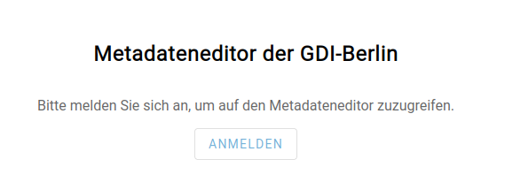

### Anmeldung

Nutzende melden sich mit ihrem Benutzernamen und Passwort am System an.

Nach der Anmeldung wird den Nutzenden eine Begrüßungsseite angezeigt.

Über den Link „Zur Metadaten Übersicht“ gelangen die Nutzenden zur Übersicht aller Metadaten, Details dazu gibt es [hier](#übersicht-der-metadatensätze).

### Breadcrumb-Navigation

Im linken Bereich der Kopfzeile befindet sich die Breadcrumb-Navigation:

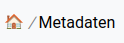

Die Breadcrumb-Navigation ermöglicht den Nutzenden eine direkte Navigation während der Bearbeitung von Metadaten.

An erster Stelle wird das Home-Symbol für die Begrüßungsseite angezeigt. Bei Klick springt man in diese Seite.

An zweiter Stelle folgt mit der Beschriftung "Metadaten" der Link zur Übersicht der Metadaten ohne aktive Filter. Ein Klick dorthin öffnet die [Metadatenübersicht](#übersicht-der-metadatensätze).

Haben Nutzende einen Metadatensatz geöffnet, wird die ID des Datensatzes als Link angezeigt. Am Ende der Breadcrumb-Navigation wird dem Benutzer durch „readonly" signalisiert, wenn er sich in der Leseansicht befindet.

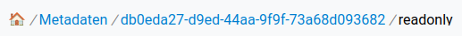

Aus der Leseansicht eines Datensatzes können Nutzende über den Link auf die ID per Klick die Editieransicht des Datensatzes öffnen, sofern sie über die notwendigen Berechtigungen verfügen. Die „readonly"-Markierung verschwindet entsprechend im Breadcrumb-Menü.

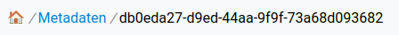

### Mein Account

Oben rechts in der Kopfzeile der Oberfläche wird den Nutzenden über die Schaltfläche „Mein Account“ der Benutzername, die Rolle sowie die verbleibende Dauer der Sitzung angezeigt. Zudem haben sie dort die Möglichkeit, sich vom System abzumelden.

Bei jedem Speichern bzw. bei jeder Änderung der Angaben zu einem Metadatensatz wird die Session erneuert. Dieser Mechanismus greift nach fünf Minuten Tätigkeit im MDE. Erfolgt keine aktive Tätigkeit durch eine Eingabe innerhalb der gültigen Session von 30 Minuten, werden Nutzende vom System abgemeldet.

### Übersicht der Metadatensätze

Die Übersichtsseite ist der zentrale Einstiegspunkt für die weiteren Arbeitsschritte.

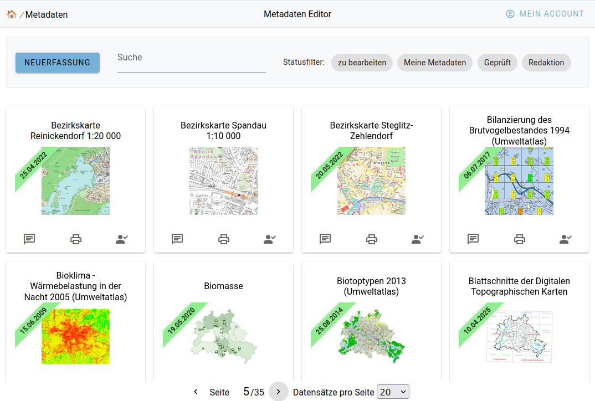

Zunächst werden dn Nutzenden alle Metadatensätze des Systems angezeigt.

Die Sortierung hängt hierbei von der Rolle und vom Status des Metadatensatzes ab. Sie werden in folgender Reihenfolge angezeigt:

- alle Metadatensätze, die Nutzende in Bearbeitung haben. Hierbei werden die Datensätze mit dem aktuellsten Bearbeitungsdatum priorisiert
- alle Metadatensätze, die der Rolle der Nutzenden zugeordnet sind in einer alphabetischen Sortierung über den Titel des Metadatensatzes
- alle weiteren Metadatensätze, alphabetisch sortiert

Die Metadatensätze werden als Kacheln dargestellt und zeigen die folgenden Angaben und Funktionsbuttons, wobei letztere von der Rolle und dem Status des Datensatzes abhängig sind:

- den Titel
- das Vorschaubild als Link zur Leseansicht
- ein Banner mit dem Datum der letzten Veröffentlichung
- Angaben zum Status des Datensatzes
- Funktionsbuttons

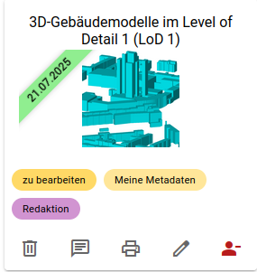

Die Status sind:

| Icon                                                                                                                                              | Funktion                      | Beschreibung                                                                                                                                                                         |
| ------------------------------------------------------------------------------------------------------------------------------------------------- | ----------------------------- | ------------------------------------------------------------------------------------------------------------------------------------------------------------------------------------ |
|                                                                      | zu bearbeiten                 | der Datensatz ist bereits von anderen angemeldeten Personen in Bearbeitung genommen worden und ist damit für andere Nutzende für eine Bearbeitung gesperrt                               |
|                                                                    | Meine Metadaten               | Nutzende haben bereits an diesem Datensatz gearbeitet und sind damit im Team der Bearbeitenden. Damit kann der Datensatz ihnen direkt zugewiesen werden (siehe [Zuweisen](./arbeitsablaeufe.mdx#zuweisen) von Datensätzen) |
|      | Angabe zur zugewiesenen Rolle | die dem Datensatz zur Bearbeitung zugewiesene Rolle wird für die Rollen Redaktion und QS angezeigt                                                                                   |
|                                                                           | Geprüft                       | der Datensatz wurde durch die Qualitätssicherung geprüft und für die Veröffentlichung freigegeben                                                                                    |

Folgende Funktionen sind über entsprechende Buttons an der Kachel implementiert. Diese variieren je nach Rolle und Berechtigungen der jeweiligen Nutzenden.

| Icon                                                                    | Funktion                                           | Beschreibung                                                                                                                                                                                                                                                                                                                  |
| ----------------------------------------------------------------------- | -------------------------------------------------- | ----------------------------------------------------------------------------------------------------------------------------------------------------------------------------------------------------------------------------------------------------------------------------------------------------------------------------- |
|   | Löschen                                            | je nach Berechtigung können Nutzende einen Datensatz löschen. Es erfolgt zunächst eine Sicherheitsabfrage, die bestätigt werden muss, um den Datensatz endgültig zu löschen.                                                                                                                                                |
|  | Kommentieren                                       | es öffnet sich der Dialog zum Kommentieren von Datensätzen                                                                                                                                                                                                                                                                    |
|    | Drucken                                            | öffnet die Leseansicht mit aktivierter Druckfunktion des Browsers                                                                                                                                                                                                                                                             |
|     | Bearbeiten                                         | öffnet das Formular zum Editieren des Datensatzes                                                                                                                                                                                                                                                                             |
|   | In Bearbeitung nehmen                              | Nutzende können sich je nach Berechtigung den Datensatz zur Bearbeitung zuweisen oder ihre Zuweisung entfernen, so dass eine andere Person den Datensatz in Bearbeitung nehmen kann. Ein Datensatz, den sich eine Person zugewiesen hat (in Bearbeitung genommen hat), ist für andere Personen zur Bearbeitung gesperrt. |
|   | Die Bearbeitung beenden und die Zuordnung aufheben | Nutzende entfernen hier ihre Zuweisung als Bearbeitende. Damit ist der Datensatz der Rolle weiterhin zugewiesen und der Datensatz für Nutzende der Rolle bearbeitbar.                                                                                                                                                     |

Über Paging-Elemente unterhalb der Metadatenübersicht kann durch die einzelnen Seiten geblättert werden und die Anzahl der Datensätze, die pro Seite angezeigt werden sollen, verändert werden.

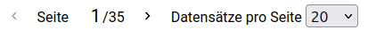

### Neuerfassung eines Metadatensatzes

Über die entsprechende Schaltfläche öffnet sich der Dialog zum Erfassen eines neuen Datensatzes:

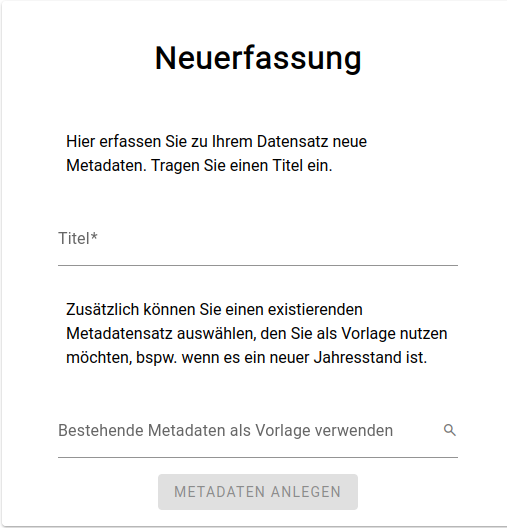

Zunächst muss der Titel des neu zu erfassenden Metadatensatzes eingegeben werden. Nutzende können einen bereits bestehenden Metadatensatz als Vorlage auswählen. Dafür steht ihnen eine Suche nach Metadatensätzen zur Verfügung. Die Suche durchsucht bestehende Metadatensätze als Teil des Titels, wobei die Eingabe ohne Berücksichtigung der Groß- und Kleinschreibung gesucht wird.

Nach der Eingabe des Titels und ggf. der Auswahl einer Vorlage wird mit einem Klick auf den Button „Metadaten Anlegen“ das Formular zur Eingabe der Metadaten geöffnet. Details zum Formular finden sich in [diesem](#metadaten-formular) Kapitel.

Wurde für den neuen Metadatensatz eine Vorlage genutzt, werden ausgewählte Felder des neuen Metadatensatzes bereits aus der Vorlage übernommen. Weitere Felder können über einen entsprechenden Button am rechten Rand der Eingabe aus der Vorlage nachträglich übernommen werden. Details dazu finden sich im [Metadaten-Formular-Kapitel](#metadaten-formular).

Im Falle der Neuerfassung eines Metadatensatzes ist dieser bereits einer Person zugewiesen, nämlich der nutzenden Person, die den Datensatz angelegt hat. Diese kann den Datensatz direkt bearbeiten oder auch anderen Nutzenden zuweisen.

### Metadatensätze filtern

#### Filter Eingabe

Über ein Eingabefeld kann die Anzeige der Metadatensätze eingeschränkt werden. Es wird das Vorkommen der Zeichenkette ohne Berücksichtigung von Groß- und Kleinschreibung für den Filter verwendet.

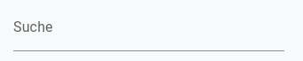

#### Statusfilter

Je nach Rolle stehen Nutzenden vordefinierte Filter zur Verfügung. Aktive Filter werden durch ein Häkchen markiert sowie farblich hervorgehoben.

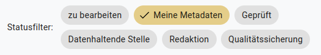

Die vordefinierten Filter variieren je nach Rolle der nutzenden Person.

Diese sind:

- **zu bearbeiten** – der Filter zeigt lediglich die Metadatensätze an, die der nutzenden Person zugewiesen sind.
- **Meine Metadaten** – es werden nur Metadatensätze angezeigt, bei denen die nutzende Person im Team ist, d.h. sie war bereits an der Bearbeitung dieser Metadatensätze beteiligt
- **Geprüft** – der Filter zeigt nur Datensätze an, die von der Rolle QS als geprüft markiert wurden
- **jeweilige Rolle** – Nutzende können die Datensätze filtern, die ihrer Rolle zugewiesen wurden. Dieser Filter steht der Rolle DHS nicht zur Verfügung, da die Zuweisung sich immer auf eine nutzende Person bezieht.

Hinweis: Wollen Nutzende aus der Einzelansicht eines Metadatensatzes zurück auf die Übersicht der Metadatensätze mit bereits festgelegten Filtern navigieren, können sie dies über den Zurück-Button des Browsers vornehmen. Alle Filter sind zudem in der URL als Parameter vorhanden, so dass sie über die Lesezeichen-Funktion des Browsers Filterkombinationen als Lesezeichen ablegen können.

### Metadaten-Formular

Über das Metadaten-Formular werden die Metadaten eingepflegt und bearbeitet.

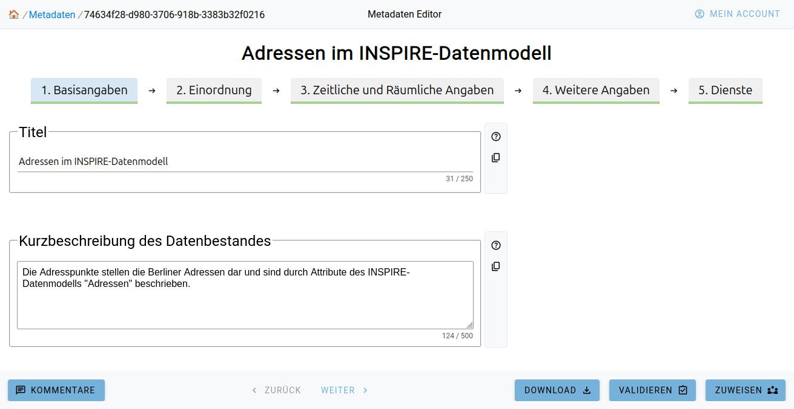

Das Eingabeformular ist in fünf Bereiche unterteilt:

1. Basisangaben
2. Einordnung
3. Zeitliche und Räumliche Angaben
4. Weitere Angaben
5. Dienste

Diese werden als „Karteireiter“ unterhalb des Titels angezeigt und können dort direkt angesteuert werden. Unterhalb der Beschriftung des jeweiligen Reiters signalisiert ein Balken, inwieweit die Vollständigkeit der Angaben erreicht ist. Der Fortschrittsbalken ist grün eingefärbt, der Hintergrund rot, sodass sich leicht erkennen lässt, welche Angaben noch fehlen. Ein Überfahren des Balkens mit der Maus zeigt den prozentualen Erfüllungsstand der Pflichtangaben.

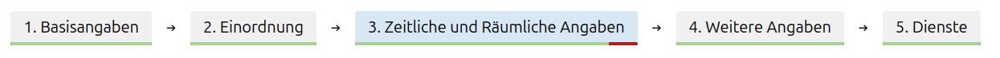

Das Formular besteht aus einer Vielzahl verschiedener Formularelement-Typen. Je nach Art der Eingabe variiert der Typ und ist auf die Eingabe optimiert. Begrenzungen von Texteingaben hinsichtlich ihrer Länge werden am Formularfeld signalisiert.

Eingaben werden automatisch gespeichert, sobald die nutzende Person das Eingabefeld verlässt. Es ist nicht notwendig, die Eingaben manuell zu speichern. Alle Änderungen werden automatisch in der Datenbank gespeichert. Das erfolgreiche Speichern wird durch ein blaues Häkchen am rechten Rand des Eingabefeldes signalisiert.

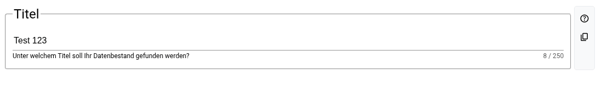

Fehlende Pflichtangaben oder fehlerhafte Eingaben werden im Formular selbst mit einem roten Rahmen hervorgehoben.

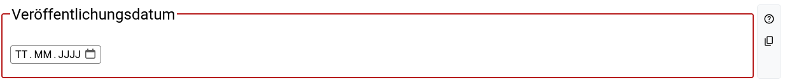

Rechts neben den Eingabefeldern oder auch links oben an Eingabebereichen werden ggf. weitere Funktionen angeboten:

| Icon                                                                   | Funktion                              | Beschreibung                                                                                                                   |
| ---------------------------------------------------------------------- | ------------------------------------- | ------------------------------------------------------------------------------------------------------------------------------ |
| 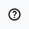   | Hilfe                                 | am rechten Rand des Formulars wird eine ausführliche Hilfe zu den Angaben des Formularfeldes angezeigt, siehe [hier](#hilfe-funktion)                         |
| 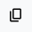   | Kopieren                              | die Werte können in die Zwischenablage kopiert werden, um sie ggf. in andere Formulare einzufügen                              |
| 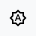 | Wert aus Vorlage übernehmen           | als Eingabehilfe können ggf. Werte übernommen werden, z.B. die Kontaktdaten der nutzenden Person aus den Angaben des AD bzw. Keycloak |
| 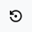 | Werte aus Vorlagedatensatz übernehmen | Es werden Werte aus dem Datensatz, der als Vorlage diente, übernommen                                                          |
|  | Löschen                               | es können Eingabebereiche entfernt werden, nachdem eine Sicherheitsabfrage bestätigt wurde                                     |

Unterhalb des Formulars werden in einer Fußzeile die folgenden Funktionen angeboten:

| Icon                                                                           | Beschreibung                                                                                                                                                                                                       |
| ------------------------------------------------------------------------------ | ------------------------------------------------------------------------------------------------------------------------------------------------------------------------------------------------------------------ |
|      | es können Kommentare zum jeweiligen Metadatensatz hinterlegt werden. Der jeweils letzte Kommentar kann wieder gelöscht werden, Beispiel siehe [hier](#kommentare)                                                                                    |
| 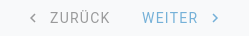 | wechselt in den jeweils nächsten oder vorhergehenden Karteireiter                                                                                                                                                  |
|        | erzeugt einen Export aller ISO-Metadatendokumente und bietet diese in einem Zip-Archiv zum Download an                                                                                                             |
|      | prüft die Eingaben gegen die Testklassen der GDI-Testsuite und gibt die Ergebnisse aus, Beispiel siehe [hier](#validierung)                                                                                                                             |
|        | Ermöglicht das [Zuweisen](./arbeitsablaeufe.mdx#zuweisen) des Metadatensatzes zu einer Rolle oder auch einr bestimmten nutzenden Person. Im Falle der QS kann hier auch der Metadatensatz als geprüft markiert werden.                                         |
|        | Ein von der QS als geprüft markierter, vollständig ausgefüllter Metadatensatz kann veröffentlicht werden. Dies bedeutet, dass der Metadatensatz im GeoNetwork opensource als als Datensatz im Metadatenkatalog veröffentlicht wird, Beispiel siehe [hier](#freigabe) |

#### Hilfe-Funktion

Klicken Nutzende am rechten Rand des Formularfeldes auf die entsprechende Schaltfläche, so wird eine ausführliche Hilfe zu den Angaben des Formularfeldes angezeigt.

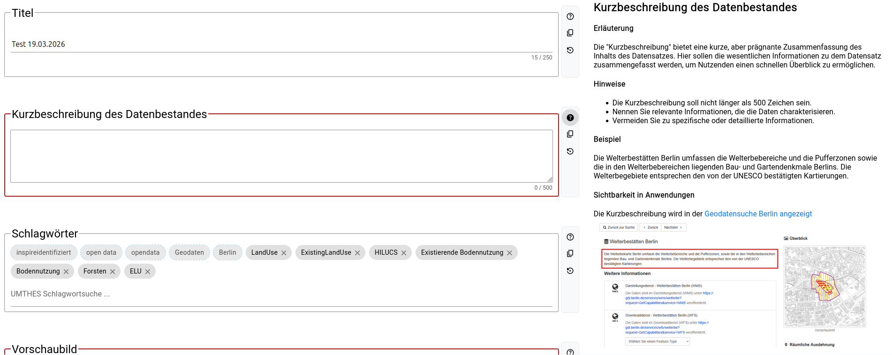

#### Kommentare

Es können Kommentare zum jeweiligen Metadatensatz hinterlegt werden.

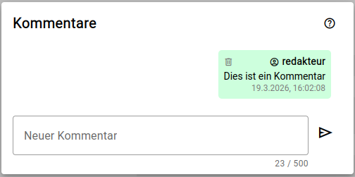

#### Validierung

Es werden die Eingaben gegen die Testklassen der GDI-Testsuite validiert und das Ergebnis ausgegeben.

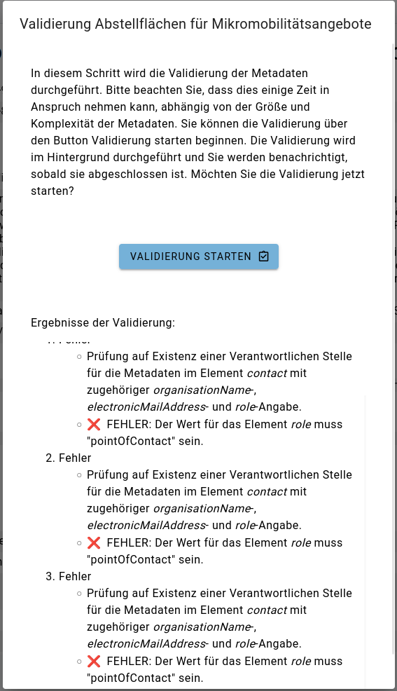

#### Freigabe

Per Klick auf den Freigabe-Button öffnet sich der Dialog, mit dem die Freigabe gestartet werden kann.

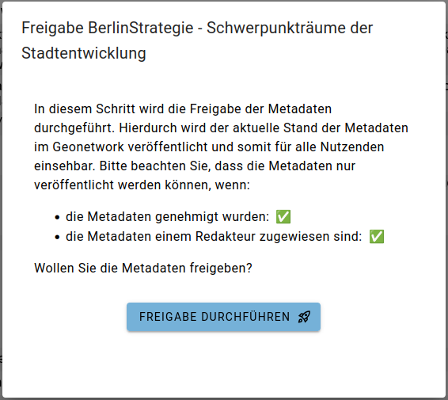

Nach erfolgreicher Freigabe und Veröffentlichung der Metadaten im GeoNetwork opensource können die erstellten Metadaten per Link aufgerufen werden.

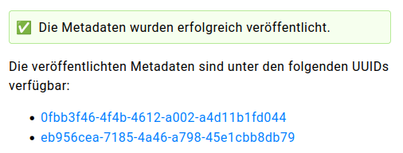
